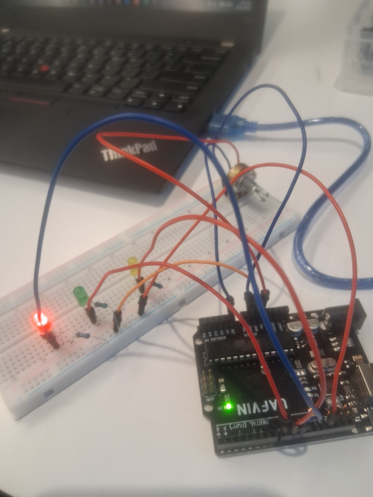

# OpenPLC Analog Process Indicator

> **Arduino Uno + OpenPLC Structured Text + physical analog input + real LED outputs**

My first working mechatronics / PLC bench project. A potentiometer acts as a process input, OpenPLC evaluates the signal in Structured Text, and three physical LEDs indicate LOW, MEDIUM, and HIGH process states.



---

## Project Overview

This project demonstrates a complete control path from a physical analog signal to PLC logic and physical outputs.

```text
Potentiometer
     ↓
Analog Voltage
     ↓
Arduino A0
     ↓
OpenPLC %IW0
     ↓
potValue
     ↓
Structured Text
     ↓
Digital Outputs
     ↓
Green / Yellow / Red LEDs
```

**Control concept:** Sense → Decide → Act

---

## Process States

| Analog Value | State | Output |
|---:|---|---|
| 0–341 | LOW | Green LED |
| 342–682 | MEDIUM | Yellow LED |
| 683–1023 | HIGH | Red LED |

---

## Structured Text

```iecst
IF potValue <= 341 THEN
    Green := TRUE;
    Yellow := FALSE;
    Red := FALSE;

ELSIF potValue <= 682 THEN
    Green := FALSE;
    Yellow := TRUE;
    Red := FALSE;

ELSE
    Green := FALSE;
    Yellow := FALSE;
    Red := TRUE;
END_IF;
```

Source: [`src/main.st`](src/main.st)

---

## Hardware

- Arduino Uno
- Breadboard
- Potentiometer
- Green, yellow, and red LEDs
- 220 Ω resistors
- Jumper wires
- Digital multimeter

## Software

- OpenPLC Editor
- IEC 61131-3 Structured Text
- Arduino Uno target

---

## Troubleshooting Story

The first successful build powered the green LED, but turning the potentiometer did not change the process state.

Instead of changing the entire system, I isolated the output side and manually commanded each PLC output:

```text
Green  ✅
Yellow ✅
Red    ✅
```

With all three physical outputs proven, the fault had to be upstream.

Following the signal path revealed the issue:

**Arduino A0 had not been mapped correctly to the OpenPLC analog input.**

After correcting the A0 mapping, rebuilding, and uploading the firmware, the potentiometer successfully controlled all three process states:

```text
LOW    → GREEN
MEDIUM → YELLOW
HIGH   → RED
```

---

## What I Learned

- DC voltage measurement with a multimeter
- Resistance and continuity testing
- Breadboard power distribution
- Arduino analog input and ADC behavior
- OpenPLC I/O mapping
- IEC 61131-3 Structured Text
- PLC input/output troubleshooting
- Proving outputs independently before chasing input faults
- Treating I/O mapping as part of the signal path

---

## Technician Principle

### OHM — Follow the Signal

```text
Observe
   ↓
Measure
   ↓
Isolate
   ↓
Verify
   ↓
Correct
   ↓
Retest
```

The key lesson from this build was not just making the LEDs work. It was learning to narrow the fault, prove known-good sections, and trace the missing signal path.

---

## Current Status

- [x] Potentiometer input
- [x] Arduino A0
- [x] OpenPLC analog mapping
- [x] Structured Text control logic
- [x] Green output
- [x] Yellow output
- [x] Red output
- [x] Physical process-state transitions

---

## Next Steps

- [ ] Add hysteresis around process thresholds
- [ ] Add pushbutton acknowledge/reset
- [ ] Add a latched HIGH-state alarm
- [ ] Add a motor or fan output
- [ ] Build a PLC state machine
- [ ] Add Node-RED visualization
- [ ] Add Splunk telemetry

---

## Why I Built This

I am building a hands-on mechatronics training bench to learn industrial automation from the signal level upward.

Rather than treating the Arduino, PLC software, meter, sensors, and outputs as separate tools, the goal is to understand how they work together as one control system.

**OHM — Follow the Signal.**

---

*First working OpenPLC / physical-I/O mechatronics project — September 2026.*
